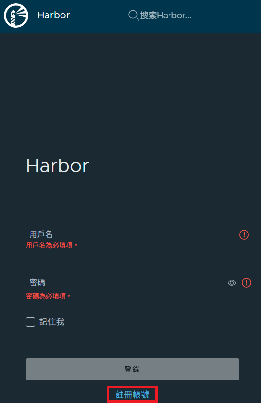
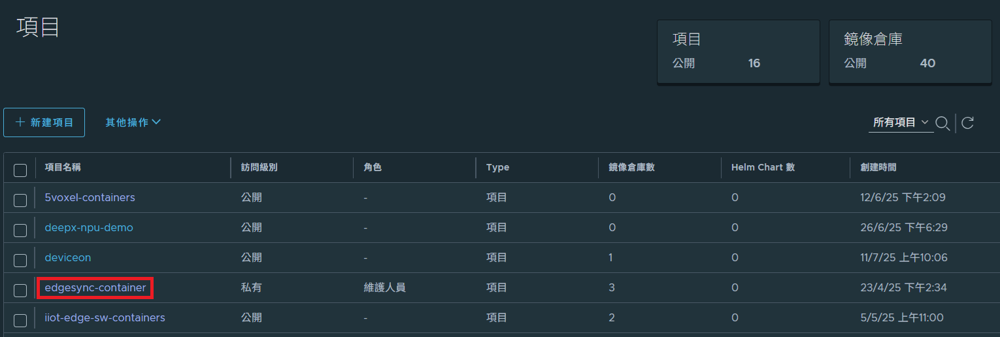
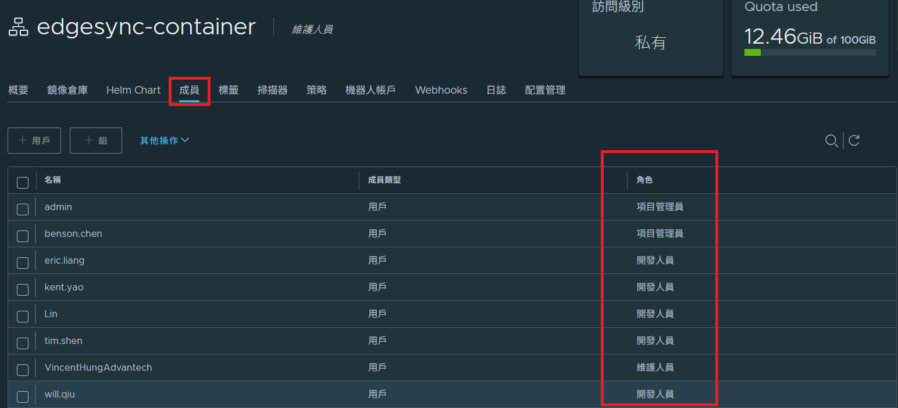
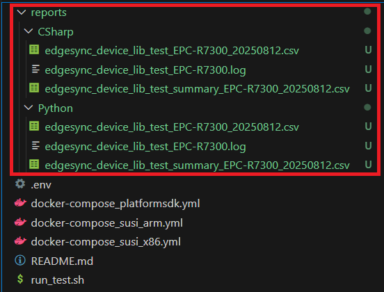

# Advantech-EdgeSync-Device-Library-TestingTool

# Purpose
This document provides guidelines for test engineers to execute and manage tests for the `Device Library`. It covers Docker-based testing environments to ensure consistency and reliability across platforms. The tested features include:
- Platform Information (Motherboard name, DMI info, etc.)
- Onboard Sensors (Temperature, Voltage, Fan speed)
- GPIO (Get/Set direction, Get/Set level)
- Watchdog (Configuration, Start/Stop watchdog)
- Thermal Protection (Configuration, Enable/Disable thermal protection for each thermal zone)
- Data Acquisition integrated with DAQNavi (Analog input/output)
- Data Acquisition integrated with DAQNavi (Digital input/output)

# Overview
- **Library Name**: `Device Library`
- **Implementation**：C#
- **Test Types**:
    *   Containerized Tests (Docker)

# Environment Requirements
## Host Environment

- Operating System : Linux

## Docker Environment

- Docker Engine : v20.10.x or later

# Prerequisites
- Install SUSI or PlatformSDK on host device.
  - For EIoT products : [SUSI API](https://github.com/ADVANTECH-Corp/SUSI)
  - For IIoT products : [PlatformSDK (EAPI)](https://www.advantech.com/zh-tw/support/details/%E8%BB%9F%E9%AB%94-api?id=1-1W0B5BW)
- Optional: Install DAQNavi on host device for testing data acquisition features.
  - For **x86/x64 platform** : [XNavi – The installation tool for DAQNavi/SDK](https://www.advantech.com/zh-tw/support/details/%E9%A9%85%E5%8B%95%E7%A8%8B%E5%BC%8F?id=1-1YPCECD)
  - For **ARM platform** : Please contact Advantech support for DAQNavi installation package for ARM platform.
- Install Docker & docker-compose on host device.

```bash
# Remove old version
sudo apt remove docker docker-engine docker.io containerd runc

# Install essential packages
sudo apt update
sudo apt install \
     ca-certificates \
     curl \
     gnupg \
     lsb-release

# Add Docker official GPG key
sudo mkdir -p /etc/apt/keyrings
curl -fsSL https://download.docker.com/linux/ubuntu/gpg | \
    sudo gpg --dearmor -o /etc/apt/keyrings/docker.gpg

# Add package source of Docker
echo \
  "deb [arch=$(dpkg --print-architecture) signed-by=/etc/apt/keyrings/docker.gpg] \
  https://download.docker.com/linux/ubuntu \
  $(lsb_release -cs) stable" | \
  sudo tee /etc/apt/sources.list.d/docker.list > /dev/null

# Update package index and install Docker Engine
sudo apt update
sudo apt install docker-ce docker-ce-cli containerd.io

# Make current user be able to run Docker without sudo
sudo usermod -aG docker $USER
newgrp docker

# Verify installation of Docker
docker version

# Download docker-compose version 2.39.2 and change its permission.
ARCH=$(uname -m)
OS=$(uname -s)
DOCKER_COMPOSE_VERSION=v2.39.2
curl -L "https://github.com/docker/compose/releases/download/${DOCKER_COMPOSE_VERSION}/docker-compose-${OS}-${ARCH}" -o /usr/local/bin/docker-compose
chmod +x /usr/local/bin/docker-compose
sudo ln -sf /usr/local/bin/docker-compose /usr/bin/docker-compose

# Verify installation of docker-compose
docker-compose version

```

- Create Github account & assign account roles in project **[Advantech-EdgeSync-Device-Library-TestingTool](https://github.com/Advantech-Containers/Advantech-EdgeSync-Device-Library-TestingTool)**.

  - Request the repo administrator to assign access permissions for pulling repo.

- Prepare Azure DevOps PAT (Personal Access Token) for authenticated package/feed access.

  - Create an Azure DevOps PAT with the minimum required scope for your test flow.
  - Keep the PAT private and rotate it based on your organization policy.

- Edit `.env` in project root and set required environment variables.

```bash
vi .env
# Update these lines:
AZDO_PAT=your_azure_devops_pat
NUGET_PKG_TO_BE_TESTED=2.*.*
```

  - `AZDO_PAT`: Azure DevOps PAT for authenticated package/feed access.
  - `NUGET_PKG_TO_BE_TESTED`: NuGet package version to test.
    - Floating examples: `2.0.*`, `2.*.*`, `*.*.*`
    - Fixed version example: `2.0.2-rc0`

  - Ensure `.env` is not committed to source control.

- Create Harbor account & assign account roles in project **edgesync-container**.

  - Create [Harbor](https://harbor.edgesync.cloud/) account

    

  - Request the project administrator to assign appropriate permissions and verify that the access level for the **edgesync-container** project is set above 'Guest'.
    
    

    

# Testing Workflow

## Docker-Based Testing

### Step 1 : Login Harbor
```bash
docker login harbor.edgesync.cloud
```

### Step 2 : Run test script

Before running the script, ensure `.env` is updated and both `AZDO_PAT` and `NUGET_PKG_TO_BE_TESTED` are configured.

- Recommended version strategy:
  - Use floating version (for example `2.*.*`) for daily validation on latest package.
  - Use fixed version (for example `2.0.2-rc0`) for reproducible verification and issue debugging.

```bash
git clone https://github.com/Advantech-EdgeSync-Containers/Advantech-EdgeSync-Device-Library-TestingTool
cd Advantech-EdgeSync-Device-Library-TestingTool
./run_test.sh
```

Common `.env` examples:

```dotenv
# 1) Latest patch release under 2.0
NUGET_PKG_TO_BE_TESTED=2.0.*

# 2) Latest release under major version 2
NUGET_PKG_TO_BE_TESTED=2.*.*

# 3) Pin exact version for reproducibility
NUGET_PKG_TO_BE_TESTED=2.0.2-rc0
```

# Test Reports & Output

- After running the script `run_test.sh`, test reports for each programming language implementation of the Device Library will be generated.
  
  

- Each file content in the test report is summarized below：

  - **edgesync_device_lib_test_{device_model}.log** : System information of device.

    | Item            | Description       |
    |--------------------|------------|
    | Motherboard Name   | Model name of motherboard ( Ex : EPC-R7300 )  |
    | SUSI Version       | Library version of SUSI  |
  - **edgesync_device_lib_test_summary_{device_model}_{test_date}.csv** : Result summary generated by test tool running on device.
  - **edgesync_device_lib_test_{device_model}_{test_date}.csv** : Detailed result generated by test tool running on device for each test items.

# Troubleshooting

| Issue Description                  | Possible Cause                     | Solution                                           | Notes                          |
|-----------------------------------|------------------------------------|----------------------------------------------------|--------------------------------|
| Error message : **Test fail : Advantech API not installed**             | Not installed SUSI API or PlatformSDK yet.                 | Install SUSI API or PlatformSDK before running script. |      |
| Error message : **unauthorized to access repository**         | Not logged in to Harbor yet.       | Login to Harbor before running script.                     | Confirm that the account is granted **Guest** or higher access rights. |
| Error message : **Unable to find package version** or unexpected package version is used | `NUGET_PKG_TO_BE_TESTED` is invalid, too broad, or not aligned with feed content | Update `NUGET_PKG_TO_BE_TESTED` in `.env` (for example `2.0.*`, `2.*.*`, or exact `2.0.2-rc0`) and rerun test script | Prefer exact version when reproducing issues |

# Appendix


[Github - Advantech-EdgeSync-Device-Library-TestingTool](https://github.com/Advantech-Containers/Advantech-EdgeSync-Device-Library-TestingTool)
